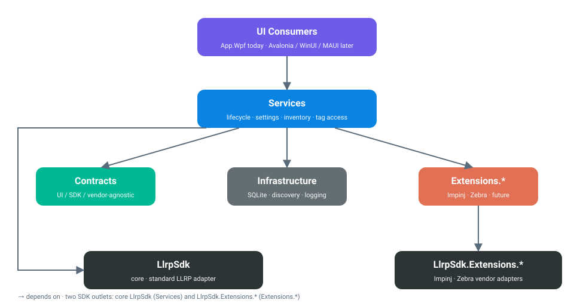
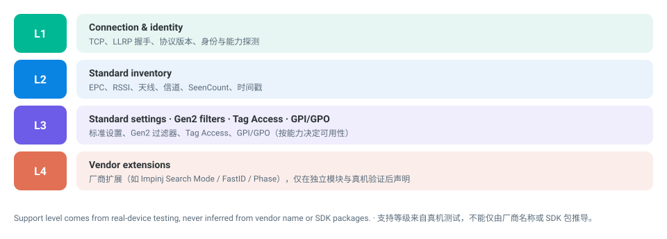

# LlrpReaderPlatform

<p align='center'>
  
</p>

<p align='center'>
  <strong>WPF operator tool and extensible application platform for real LLRP readers</strong>
</p>

<p align='center'>
  <strong>v1.0.0</strong> · Windows x64 · self-contained single-file portable · <code>LlrpSdk</code> 1.4.0
</p>

<p align='center'>
  <strong>English</strong> · <a href='README.zh-CN.md'>中文</a>
</p>

---

## Overview

LlrpReaderPlatform is a new LLRP application platform whose first deliverable is a Windows WPF application for connecting to readers, reading device capabilities, editing configuration, running inventory, and performing Tag Access. The UI keeps the operating habits of the frozen legacy `LlrpReaderStudio`, while a new services layer, an SDK adapter, and an EF Core SQLite data layer provide the implementation.

The frozen `../LlrpReaderStudio` repository is reference material only — it documents existing capabilities and migration boundaries and is never a runtime dependency.

**Current baseline:** `1.0.0` · Windows x64 · self-contained single-file portable. The build is clean (0 warnings, 0 errors) and automated tests are green (368 tests). Automated tests use a `FakeSession`; real-device conclusions are recorded separately.

## Architecture

Dependencies flow in one direction. `Contracts` stays UI-, SDK-, and vendor-agnostic; `Services` owns the device semantics; `Infrastructure` and `Extensions.*` provide implementations; the WPF app is only a consumer.



```text
UI consumer -> Services -> Contracts
                       -> Infrastructure
                       -> Extensions.*
```

- **Contracts** — UI-agnostic DTOs, state, settings-editing models, and service interfaces; it must not reference WPF, the SDK, or vendor extension types.
- **Services** — reader lifecycle, connection leases, capability aggregation, settings, inventory, and Tag Access.
- **Infrastructure** — SQLite, presets/profiles, discovery, and logging implementations.
- **Extensions.\*** — pluggable vendor modules (Impinj baseline, Zebra experimental); they never pollute the common contracts.
- **App.Wpf** — the first UI consumer (WPF, CommunityToolkit.Mvvm, MahApps.Metro); future UI frameworks can reuse the same services and contracts.

On the SDK side there are two outlets: core `LlrpSdk` (the standard LLRP adapter consumed by `Services`) and `LlrpSdk.Extensions.Impinj` / `LlrpSdk.Extensions.Zebra` (the vendor adapters consumed by `Extensions.*`).

**Reader ownership rule** — one `ReaderHandle` owns one TCP `ReaderSession`; commands to a reader serialize through that session's single `Gate`. Inventory is a long-running lease, while settings, Tag Access, and GPO are short operations that return an explicit `ReaderBusy` on conflict instead of silently restarting inventory.

## Compatibility layers

The platform works across four compatibility layers. Support is claimed layer by layer from real-device testing, never inferred from a vendor name or an SDK package.



- **L1** — connection, LLRP handshake, protocol version, identity, capability discovery.
- **L2** — standard inventory: EPC, RSSI, antenna, channel, SeenCount, timestamps.
- **L3** — standard settings, Gen2 filters, Tag Access, GPI/GPO (availability gated by capability).
- **L4** — vendor extensions (e.g. Impinj Search Mode, FastID, Phase) only after a dedicated module and real-device validation.

## Core capabilities

- **Reader lifecycle** — discover → probe → activate → capability/settings query → inventory or short operation → stop → disconnect. Each reader exclusively owns its LLRP session and command queue.
- **Standard LLRP** — LLRP 1.0.1 baseline with connection strategies Auto / Force 1.0.1 / Force 1.1, plus gating infrastructure for 1.1 / 2.0 (marked `PendingHardware` until real devices are available).
- **Standard configuration** — editable settings generated from the reader capability table; Tx power, Rx sensitivity, RF mode, session, tag population, report, and antenna configuration write real device index/id.
- **Inventory** — unified tag events; multi-reader parallelism, lifecycle stop reasons, count aggregation, TID, RSSI, antenna, channel, and time information.
- **Tag Access** — EPC/TID/User/Reserved memory bank read/write gated by device capability; unsupported devices or banks are never misreported as available in the UI.
- **GPI/GPO** — port status query, GPO control, and GPI events; controls are generated from real port capability.
- **Vendor extensions** — Impinj R420 (Search Mode, FastID, Phase, Low Duty, fixed frequency, GPI debounce, extended tag fields) via an independent module; Zebra is wired as an experimental module and is not claimed as supported until real-device calibration.
- **Local data** — EF Core SQLite stores reader profiles, settings presets, TOI, inventory runs, and app settings.
- **Diagnostics & logging** — UI, platform services, and SDK/LLRP messages are logged in layers; inventory snapshots and optional raw JSONL reports.

## Application pages

| Page | What it does |
|---|---|
| **Data Sources** | Auto-discover or manually add readers; configure IP, port, and LLRP version policy; enable/disable; see connection, capability, and error state. |
| **Reader Settings** | Read, edit, save, and load defaults organized in Tab1/Tab2; RF, antenna, power, report, and GPI/GPO gated by capability. |
| **Inventory** | One or many readers simultaneously; Start/Stop, duration, auto-stop; live EPC, TID, count, RSSI, antenna, channel, time, and TOI. |
| **Tag Memory** | Pick an enabled reader and an EPC/TID from inventory, then read/write EPC, TID, User, and Reserved banks; operation timeouts surface on this page. |
| **Tags of Interest (TOI)** | Maintain EPC, name, and color; inventory rows show the matching name/color; add, delete, edit, save. |
| **Inventory Runs** | History with start/end time, duration, read count, unique tag count, and stop reason. |
| **Software Settings** | App-level options: database, logging, and inventory recording mode. |
| **About** | Application version and product info. |

The UI uses native WPF `ProgressBar`, MahApps.Metro, and FontAwesome icons. Tables, settings groups, GPI/GPO, and antenna configuration keep the legacy WPF operating style and hide options the reader does not actually support.

## Typical workflow

1. Start the app and discover or add a reader under **Data Sources**.
2. Choose the protocol policy, probe, and enable the reader.
3. Open **Reader Settings**, read the current settings, adjust Tab1/Tab2 by capability, and save.
4. Enter **Inventory**, choose a duration or auto-stop condition, and start one or more readers.
5. Watch EPC/TID, RSSI, antenna, TOI, and stats; go to **Tag Memory** to access tags.
6. After stopping, review the run and snapshot under **Inventory Runs**.

## First-release device support boundary

| Device | Status |
|---|---|
| Standard LLRP 1.0.1 reader | Connection, identity/capability query, and part of standard settings accepted; inventory, Tag Access, and GPI/GPO continue field acceptance per device capability. |
| Impinj R420 | First real-device baseline; verified connection, standard/Impinj settings, inventory, EPC/TID/User/Reserved read, User write-restore, GPO, and part of GPI/extended fields. |
| Standard reader `192.168.41.148` | Verified forced LLRP 1.0.1 probe, activate, settings query, and part of settings write-back; inventory/Tag Access await antenna and field acceptance. |
| Other vendor readers | Work through standard LLRP first; vendor extensions are only claimed after a dedicated module and real-device validation. |

The authoritative record is the [device compatibility matrix](docs/compatibility/device-matrix.md). Code tests, protocol mappings, or SDK capability tables cannot replace acceptance with real readers, antennas, and tags.

## Download & run

Official releases are produced by GitHub Actions as a ZIP containing the self-contained single-file app plus README/release notes:

- `LlrpReaderPlatform-v1.0.0-win-x64.zip`
- matching `.sha256` checksum

Requirements: Windows x64; the reader must be reachable over the network, default LLRP port `5084`. The single file bundles the .NET runtime, so target machines do not need a separate .NET Desktop Runtime.

On first run the app creates its SQLite database, logs, and inventory snapshot directory under `%LocalAppData%\LlrpReaderPlatform\`.

## Build & publish

On a Windows machine with the .NET 10 SDK:

```powershell
dotnet restore LlrpReaderPlatform.slnx -p:UseLocalLlrpSdk=false
dotnet build LlrpReaderPlatform.slnx -c Release --no-restore -p:UseLocalLlrpSdk=false
dotnet test LlrpReaderPlatform.slnx -c Release --no-build --no-restore -p:UseLocalLlrpSdk=false
dotnet publish src/LlrpReaderPlatform.App.Wpf/App.Wpf.csproj `
  -c Release -r win-x64 --self-contained true `
  -p:PublishSingleFile=true `
  -p:IncludeNativeLibrariesForSelfExtract=true `
  -p:EnableCompressionInSingleFile=true `
  -p:DebugType=None -p:DebugSymbols=false `
  -p:UseLocalLlrpSdk=false `
  -o artifacts/publish/win-x64 --no-restore
```

The publish result is `LlrpReaderPlatform.exe`. For a local portable package, keep only the EXE under `src/LlrpReaderPlatform.App.Wpf/bin/Portable/LLRPReaderPlatform-win-x64/`; the WPF single-file runtime may temporarily extract native components to the system temp directory, which is expected.

By default the platform uses the centrally versioned `LlrpSdk` `1.4.0` and `LlrpSdk.Extensions.Impinj` / `LlrpSdk.Extensions.Zebra` `1.4.0` NuGet packages. Local SDK debugging is opt-in via `UseLocalLlrpSdk=true` (pointing at a sibling `LLRPCSharp` checkout); CI and releases always use the NuGet mode.

## Documentation

### For users & validation

- [WPF user guide & troubleshooting](docs/development/wpf-user-and-troubleshooting.md)
- [Hardware validation runbook](docs/development/hardware-validation-runbook.md)
- [Hardware test CLI project](tests/LlrpReaderPlatform.Hardware.Tests/LlrpReaderPlatform.Hardware.Tests.csproj)
- [Device compatibility matrix](docs/compatibility/device-matrix.md)
- [v1.0.0 release notes](docs/releases/v1.0.0.md)
- [Release spec & pipeline](docs/development/release.md)

### For developers & extension authors

- [Overall vision](docs/llrp-framework-vision.md)
- [Architecture overview](docs/architecture/overview.md)
- [Reader lifecycle & connection ownership](docs/architecture/reader-runtime.md)
- [Vendor extensions & settings model](docs/architecture/extensions-and-settings.md)
- [Legacy WPF feature migration matrix](docs/development/legacy-feature-matrix.md)
- [Testing strategy](docs/development/testing-strategy.md)
- [ADR index](docs/decisions/README.md)

## Project boundaries

This repository contains the new platform services, infrastructure, WPF application, and automated tests. The frozen legacy `LlrpReaderStudio` is used only for behavior and migration reference, never as a runtime dependency. The current deliverable is the WPF application; no platform class-library NuGet packages are published — the SDK NuGet packages are input dependencies only.
